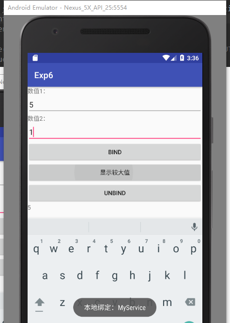
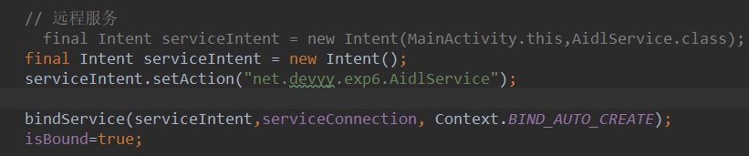
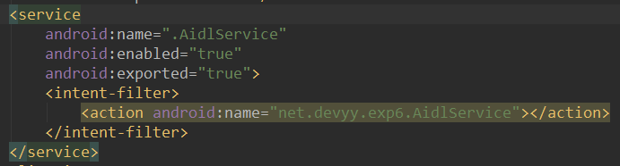
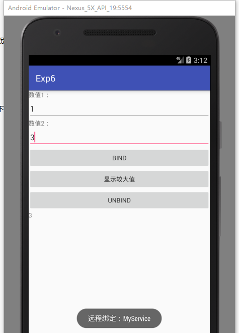
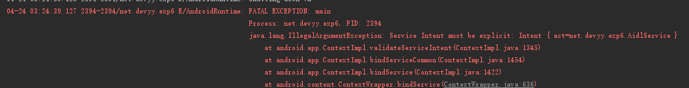
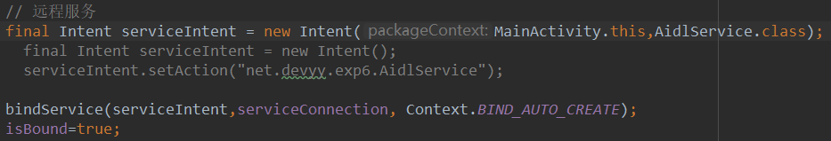
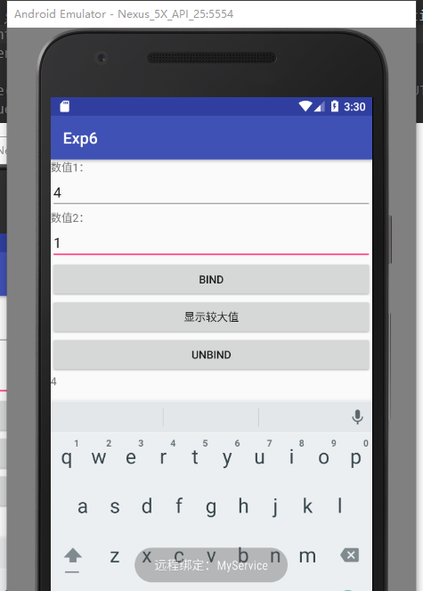

# 实验6： Android后台服务

实验要求使用Service，提供比较两个整数大小的功能，提供Int Compare(Int, Int)函数，输入两个整数，输出较大的整数。具体要求如下：

（1）实现进程内的服务；

（2）使用AIDL语言，实现相同功能的跨进程服务；

（3）设计用户界面，在界面上允许用户输入两个整数，并分别通过调用进程内和跨进程服务，将较大的数字显示在界面上。

## （1）实现进程内的服务：

## （2）使用AIDL语言，实现相同功能的跨进程服务：

首先，经实测，在Android API 4.4 的机器上，可以通过下图方式隐式调用远程服务：

但在高于在Android API 5.0 的机器上，隐式调用会失败，需显式进行调用：（经过查找相关资料，发现是因为Android5.0中service的intent一定要显性声明）。

需改为显式调用，便能成功调用：

